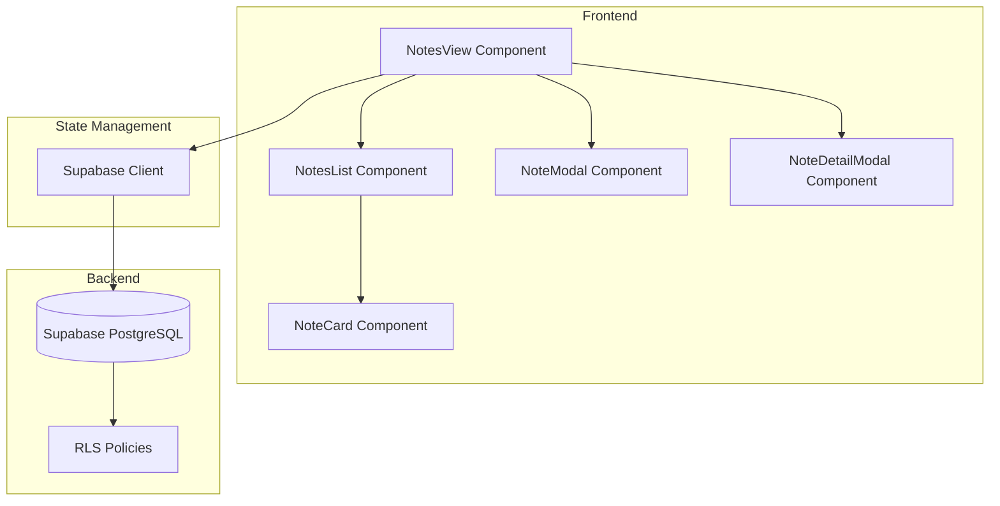

# Design Document: Notes Feature

## Overview

Fitur Notes adalah sistem manajemen catatan pribadi yang terintegrasi dengan aplikasi SubTrack. Fitur ini memungkinkan pengguna untuk membuat, membaca, mengupdate, dan menghapus catatan dengan tampilan yang elegan dan konsisten dengan desain aplikasi yang ada.

Fitur ini akan menggunakan:
- React + TypeScript untuk frontend
- Supabase untuk backend (database + RLS)
- Tailwind CSS untuk styling
- Lucide React untuk icons

## Architecture



## Components and Interfaces

### 1. NotesView (Main Container)
Komponen utama yang menampilkan seluruh fitur notes.

```typescript
interface NotesViewProps {
  onBack?: () => void;
}
```

Responsibilities:
- Mengelola state notes (list, loading, error)
- Menangani operasi CRUD
- Mengelola search dan filter
- Mengelola layout mode (grid/list)

### 2. NoteCard
Komponen untuk menampilkan preview note dalam list/grid.

```typescript
interface NoteCardProps {
  note: Note;
  onEdit: (note: Note) => void;
  onDelete: (id: string) => void;
  onClick: (note: Note) => void;
  layoutMode: 'grid' | 'list';
  index: number;
}
```

### 3. NoteModal
Modal untuk create/edit note.

```typescript
interface NoteModalProps {
  isOpen: boolean;
  onClose: () => void;
  onSave: (note: NoteInput) => Promise<void>;
  note?: Note; // undefined for create, defined for edit
}

interface NoteInput {
  title: string;
  content: string;
  color?: string;
}
```

### 4. NoteDetailModal
Modal untuk menampilkan detail note lengkap.

```typescript
interface NoteDetailModalProps {
  isOpen: boolean;
  onClose: () => void;
  note: Note | null;
  onEdit: (note: Note) => void;
  onDelete: (id: string) => void;
}
```

### 5. DeleteConfirmModal
Modal konfirmasi untuk delete note.

```typescript
interface DeleteConfirmModalProps {
  isOpen: boolean;
  onClose: () => void;
  onConfirm: () => void;
  noteTitle: string;
}
```

## Data Models

### Note Type

```typescript
export type Note = {
  id: string;
  user_id: string;
  title: string;
  content: string;
  color?: string;
  is_pinned: boolean;
  created_at: string;
  updated_at: string;
};
```

### Database Schema

```sql
CREATE TABLE notes (
  id UUID PRIMARY KEY DEFAULT gen_random_uuid(),
  user_id UUID NOT NULL REFERENCES auth.users(id) ON DELETE CASCADE,
  title VARCHAR(255) NOT NULL,
  content TEXT,
  color VARCHAR(20) DEFAULT 'default',
  is_pinned BOOLEAN DEFAULT false,
  created_at TIMESTAMPTZ DEFAULT NOW(),
  updated_at TIMESTAMPTZ DEFAULT NOW()
);

-- Index for faster queries
CREATE INDEX idx_notes_user_id ON notes(user_id);
CREATE INDEX idx_notes_created_at ON notes(created_at DESC);

-- RLS Policies
ALTER TABLE notes ENABLE ROW LEVEL SECURITY;

CREATE POLICY "Users can view own notes"
  ON notes FOR SELECT
  USING (auth.uid() = user_id);

CREATE POLICY "Users can create own notes"
  ON notes FOR INSERT
  WITH CHECK (auth.uid() = user_id);

CREATE POLICY "Users can update own notes"
  ON notes FOR UPDATE
  USING (auth.uid() = user_id);

CREATE POLICY "Users can delete own notes"
  ON notes FOR DELETE
  USING (auth.uid() = user_id);

-- Trigger for updated_at
CREATE OR REPLACE FUNCTION update_updated_at_column()
RETURNS TRIGGER AS $$
BEGIN
  NEW.updated_at = NOW();
  RETURN NEW;
END;
$$ LANGUAGE plpgsql;

CREATE TRIGGER update_notes_updated_at
  BEFORE UPDATE ON notes
  FOR EACH ROW
  EXECUTE FUNCTION update_updated_at_column();
```


## Correctness Properties

*A property is a characteristic or behavior that should hold true across all valid executions of a system-essentially, a formal statement about what the system should do. Properties serve as the bridge between human-readable specifications and machine-verifiable correctness guarantees.*

Based on the acceptance criteria analysis, the following correctness properties have been identified:

### Property 1: Note creation with valid data adds to list
*For any* valid note with non-empty title and content, when the note is saved, the notes list length should increase by one and the new note should appear in the list.
**Validates: Requirements 1.2**

### Property 2: Empty/whitespace title validation rejects save
*For any* string composed entirely of whitespace characters (including empty string), attempting to save a note with such title should be rejected and the notes list should remain unchanged.
**Validates: Requirements 1.3**

### Property 3: Note display contains required information
*For any* note in the system, when rendered as a card, the output should contain the note's title, a preview of the content, and the creation date.
**Validates: Requirements 2.2**

### Property 4: Note update persists changes and updates timestamp
*For any* existing note and any valid edit (non-empty title), saving the edit should persist the new values and the updated_at timestamp should be greater than or equal to the original timestamp.
**Validates: Requirements 3.2, 3.3**

### Property 5: Note deletion removes from list
*For any* note in the list, when deletion is confirmed, the note should no longer appear in the notes list and the list length should decrease by one.
**Validates: Requirements 4.2**

### Property 6: Search filters by title and content match
*For any* search term and any set of notes, the filtered results should only contain notes where either the title or content contains the search term (case-insensitive).
**Validates: Requirements 5.1**

## Error Handling

### Frontend Error Handling

1. **Network Errors**: Display toast notification with retry option
2. **Validation Errors**: Show inline error messages on form fields
3. **Database Errors**: Display user-friendly error message and log to console
4. **Empty States**: Show helpful empty state UI with action prompt

### Error Messages

```typescript
const ERROR_MESSAGES = {
  LOAD_FAILED: 'Failed to load notes. Please try again.',
  SAVE_FAILED: 'Failed to save note. Please try again.',
  DELETE_FAILED: 'Failed to delete note. Please try again.',
  VALIDATION_TITLE_REQUIRED: 'Title is required',
  VALIDATION_TITLE_TOO_LONG: 'Title must be less than 255 characters',
};
```

## Testing Strategy

### Property-Based Testing

Library: **fast-check** (JavaScript property-based testing library)

Configuration:
- Minimum 100 iterations per property test
- Use arbitrary generators for note data

Property tests will be tagged with format: `**Feature: notes-feature, Property {number}: {property_text}**`

### Unit Tests

Unit tests will cover:
- Component rendering with various props
- Modal open/close behavior
- Form validation logic
- Search/filter logic

### Test File Structure

```
src/
  components/
    __tests__/
      NotesView.test.tsx
      NoteCard.test.tsx
      NoteModal.test.tsx
    NotesView.tsx
    NoteCard.tsx
    NoteModal.tsx
```

## UI/UX Design

### Color Palette for Notes

```typescript
const NOTE_COLORS = [
  { value: 'default', bg: 'bg-white', border: 'border-slate-200' },
  { value: 'yellow', bg: 'bg-amber-50', border: 'border-amber-200' },
  { value: 'green', bg: 'bg-emerald-50', border: 'border-emerald-200' },
  { value: 'blue', bg: 'bg-blue-50', border: 'border-blue-200' },
  { value: 'purple', bg: 'bg-purple-50', border: 'border-purple-200' },
  { value: 'pink', bg: 'bg-pink-50', border: 'border-pink-200' },
];
```

### Layout Modes

1. **Grid Mode**: 3 columns on desktop, 2 on tablet, 1 on mobile
2. **List Mode**: Full-width cards stacked vertically

### Animations

- Card hover: subtle scale and shadow increase
- Modal: fade in/out with scale animation
- Delete: fade out animation before removal
- Search: smooth filter transition

