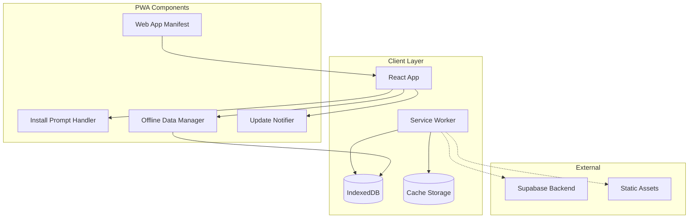
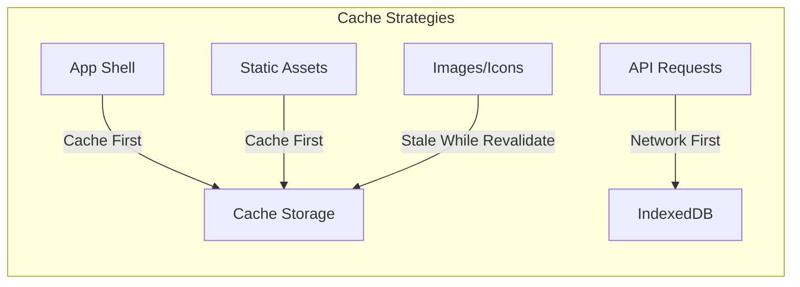

# Design Document: PWA Support

## Overview

This design document outlines the implementation of Progressive Web App (PWA) capabilities for the Subscription Manager Platform. The implementation will use Vite's PWA plugin (vite-plugin-pwa) with Workbox for service worker generation, providing offline support, installability, and improved performance through intelligent caching strategies.

## Architecture



### Caching Strategy



## Components and Interfaces

### 1. PWA Configuration (vite-plugin-pwa)

```typescript
// vite.config.ts PWA configuration
interface PWAConfig {
  registerType: 'autoUpdate' | 'prompt';
  includeAssets: string[];
  manifest: WebAppManifest;
  workbox: WorkboxConfig;
}

interface WebAppManifest {
  name: string;
  short_name: string;
  description: string;
  theme_color: string;
  background_color: string;
  display: 'standalone' | 'fullscreen' | 'minimal-ui' | 'browser';
  start_url: string;
  icons: ManifestIcon[];
}

interface ManifestIcon {
  src: string;
  sizes: string;
  type: string;
  purpose?: 'any' | 'maskable' | 'any maskable';
}
```

### 2. Install Prompt Component

```typescript
// src/components/InstallPrompt.tsx
interface InstallPromptProps {
  onInstall: () => void;
  onDismiss: () => void;
}

interface InstallPromptState {
  deferredPrompt: BeforeInstallPromptEvent | null;
  isVisible: boolean;
  isInstalled: boolean;
}

// Hook for managing install prompt
interface UseInstallPromptReturn {
  isInstallable: boolean;
  isInstalled: boolean;
  promptInstall: () => Promise<void>;
  dismissPrompt: () => void;
}
```

### 3. Offline Data Manager

```typescript
// src/lib/offlineManager.ts
interface OfflineDataManager {
  cacheSubscriptions(data: Subscription[]): Promise<void>;
  getCachedSubscriptions(): Promise<Subscription[] | null>;
  getLastSyncTimestamp(): Promise<number | null>;
  setLastSyncTimestamp(timestamp: number): Promise<void>;
  hasPendingChanges(): Promise<boolean>;
  getPendingChanges(): Promise<PendingChange[]>;
  addPendingChange(change: PendingChange): Promise<void>;
  clearPendingChanges(): Promise<void>;
  syncPendingChanges(): Promise<SyncResult>;
}

interface PendingChange {
  id: string;
  type: 'create' | 'update' | 'delete';
  data: Partial<Subscription>;
  timestamp: number;
}

interface SyncResult {
  success: boolean;
  synced: number;
  failed: number;
  errors: Error[];
}
```

### 4. Service Worker Update Handler

```typescript
// src/lib/swUpdateHandler.ts
interface UpdateHandlerConfig {
  onNeedRefresh: () => void;
  onOfflineReady: () => void;
}

interface UseServiceWorkerReturn {
  needRefresh: boolean;
  offlineReady: boolean;
  updateServiceWorker: () => Promise<void>;
}
```

### 5. Network Status Hook

```typescript
// src/hooks/useNetworkStatus.ts
interface NetworkStatus {
  isOnline: boolean;
  wasOffline: boolean;
  lastOnlineAt: number | null;
}
```

## Data Models

### IndexedDB Schema

```typescript
// Database: subscription-tracker-offline
// Version: 1

interface OfflineDatabase {
  subscriptions: {
    key: string; // subscription id
    value: Subscription;
    indexes: ['user_id', 'updated_at'];
  };
  
  pendingChanges: {
    key: string; // change id
    value: PendingChange;
    indexes: ['timestamp', 'type'];
  };
  
  metadata: {
    key: string; // 'lastSync', 'userId', etc.
    value: any;
  };
}
```

### Local Storage Keys

```typescript
interface LocalStorageKeys {
  INSTALL_PROMPT_DISMISSED: 'pwa_install_dismissed';
  INSTALL_PROMPT_DISMISSED_AT: 'pwa_install_dismissed_at';
  DISMISS_DURATION_DAYS: 7; // Don't show prompt for 7 days after dismissal
}
```

## Correctness Properties

*A property is a characteristic or behavior that should hold true across all valid executions of a system-essentially, a formal statement about what the system should do. Properties serve as the bridge between human-readable specifications and machine-verifiable correctness guarantees.*

Based on the prework analysis, the following correctness properties have been identified:

### Property 1: Manifest Validation

*For any* valid web app manifest configuration, the manifest file SHALL contain all required PWA properties (name, short_name, start_url, display, theme_color, background_color) and all icon entries SHALL reference existing files with correct MIME types.

**Validates: Requirements 1.1, 1.2**

### Property 2: Icon Completeness

*For any* icon size specified in the manifest, there SHALL exist a corresponding PNG file in the public directory with the exact dimensions specified, and the file SHALL be a valid PNG image.

**Validates: Requirements 3.1**

### Property 3: Install Prompt Dismissal Persistence

*For any* user dismissal of the install prompt, the dismissal preference SHALL be stored in localStorage, and subsequent checks for showing the prompt SHALL respect this preference until the configured duration expires.

**Validates: Requirements 4.3**

### Property 4: Subscription Data Cache Round-Trip

*For any* subscription data array, caching to IndexedDB and then retrieving SHALL return an equivalent data structure with all original properties preserved.

**Validates: Requirements 5.1**

### Property 5: Pending Changes Sync Integrity

*For any* set of pending offline changes, when the user returns online and sync is triggered, all pending changes SHALL be processed and either successfully synced or reported as failed, with no changes lost.

**Validates: Requirements 5.3**

## Error Handling

### Service Worker Registration Errors

```typescript
interface SWRegistrationError {
  type: 'not_supported' | 'registration_failed' | 'update_failed';
  message: string;
  originalError?: Error;
}

// Graceful degradation: app continues to work without SW
function handleSWError(error: SWRegistrationError): void {
  console.warn('Service Worker error:', error);
  // App continues in online-only mode
}
```

### Offline Data Errors

```typescript
interface OfflineDataError {
  type: 'indexeddb_not_supported' | 'storage_quota_exceeded' | 'read_error' | 'write_error';
  message: string;
}

// Fallback to memory cache if IndexedDB fails
function handleOfflineError(error: OfflineDataError): void {
  console.warn('Offline storage error:', error);
  // Fall back to in-memory caching
}
```

### Sync Conflict Resolution

```typescript
// Last-write-wins strategy for sync conflicts
interface ConflictResolution {
  strategy: 'last_write_wins' | 'server_wins' | 'client_wins';
  onConflict: (local: Subscription, remote: Subscription) => Subscription;
}
```

## Testing Strategy

### Unit Testing Framework

- **Framework**: Vitest (compatible with Vite)
- **Mocking**: vi.mock for IndexedDB and localStorage
- **Coverage Target**: 80% for core PWA utilities

### Property-Based Testing

- **Framework**: fast-check
- **Focus Areas**:
  - Manifest validation properties
  - Data caching round-trip properties
  - Install prompt state management

### Test Categories

1. **Manifest Validation Tests**
   - Verify manifest structure completeness
   - Validate icon references and sizes
   - Check theme color formats

2. **Install Prompt Tests**
   - Test prompt visibility logic
   - Verify dismissal persistence
   - Test installation flow

3. **Offline Data Tests**
   - IndexedDB read/write operations
   - Cache invalidation logic
   - Sync conflict resolution

4. **Service Worker Tests**
   - Registration success/failure handling
   - Update notification flow
   - Cache strategy verification

### Property-Based Test Requirements

- Each property-based test MUST run a minimum of 100 iterations
- Each test MUST be tagged with format: `**Feature: pwa-support, Property {number}: {property_text}**`
- Tests MUST use fast-check library for property generation
